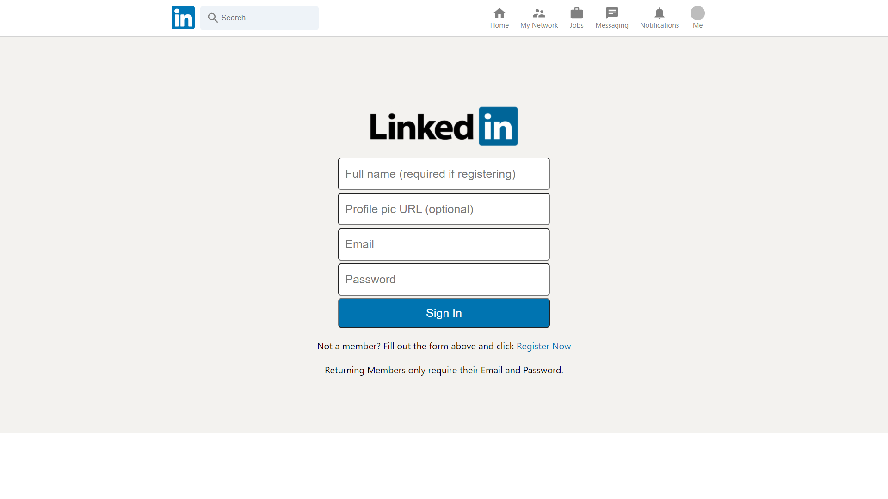
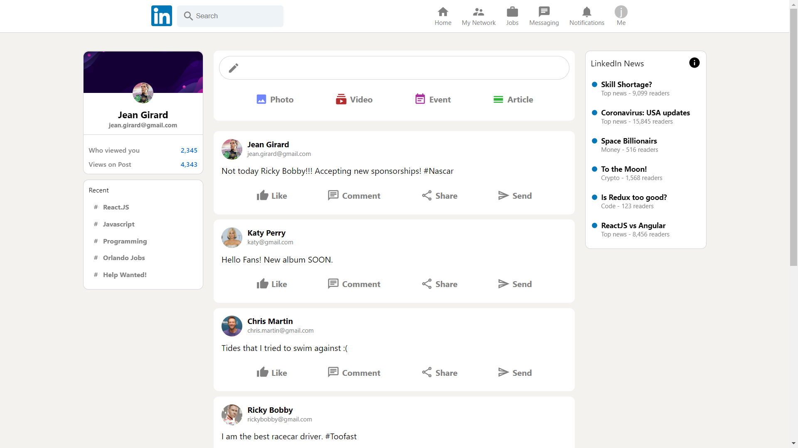

<Row>
<Col>

## Project Tools:

* React
* Javascript
* Firebase
* Redux
* CSS
* Node

</Col>
<Col>

## Links

*  **[Source Code](https://github.com/mgpirmal/Linkedin-Clone)**
*  **[Project Link](https://linkedin-beta.web.app/)**

</Col>
</Row>

## Project Images

<Row>
<Col>

</Col>
<Col>

</Col>
</Row>

